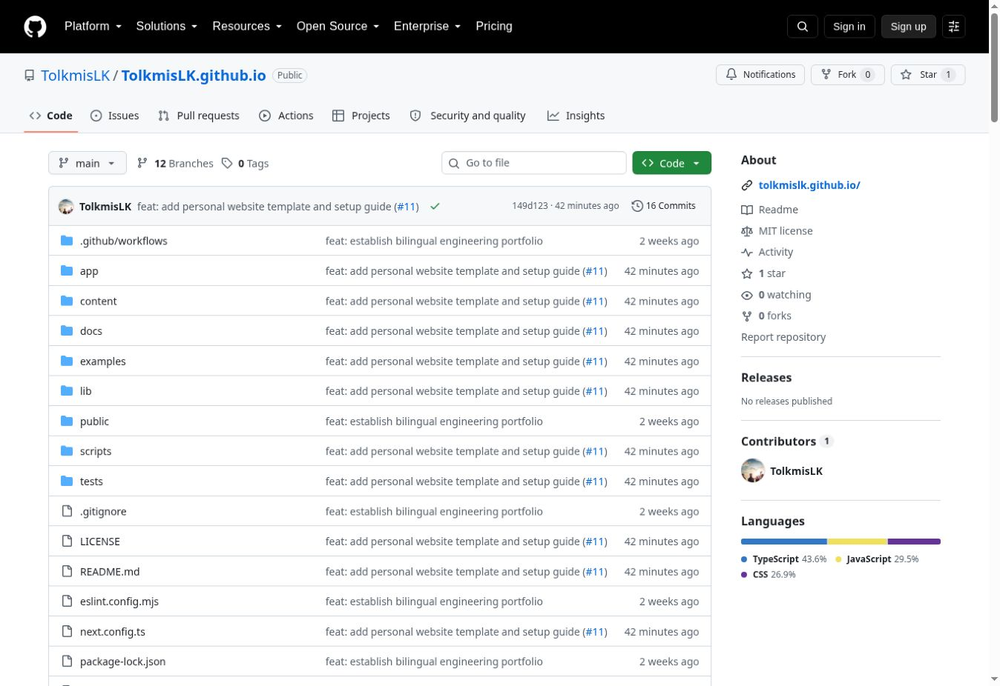
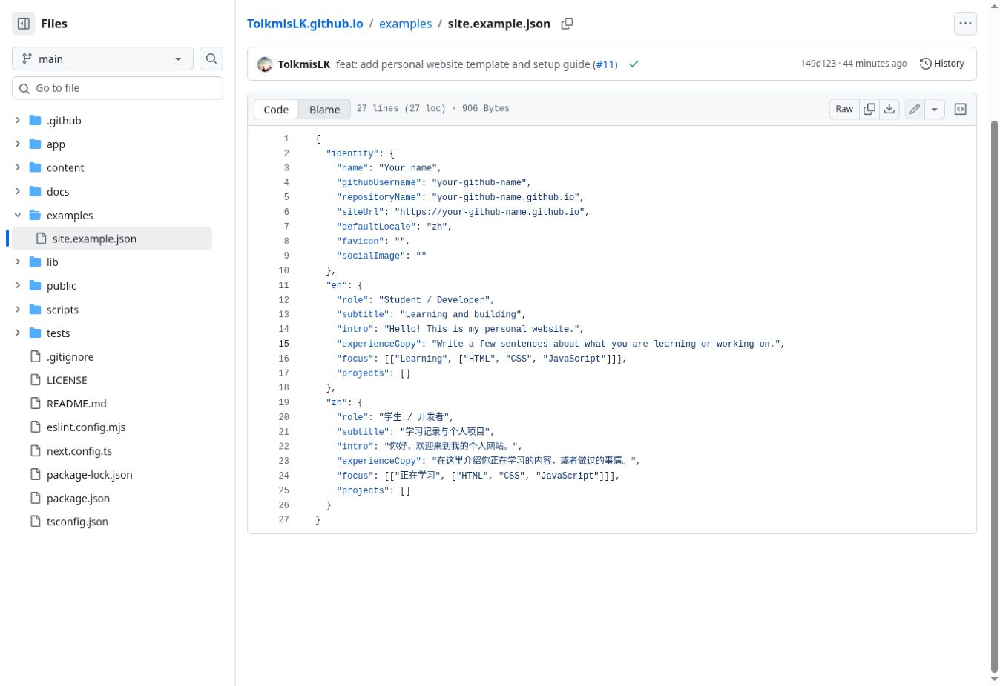
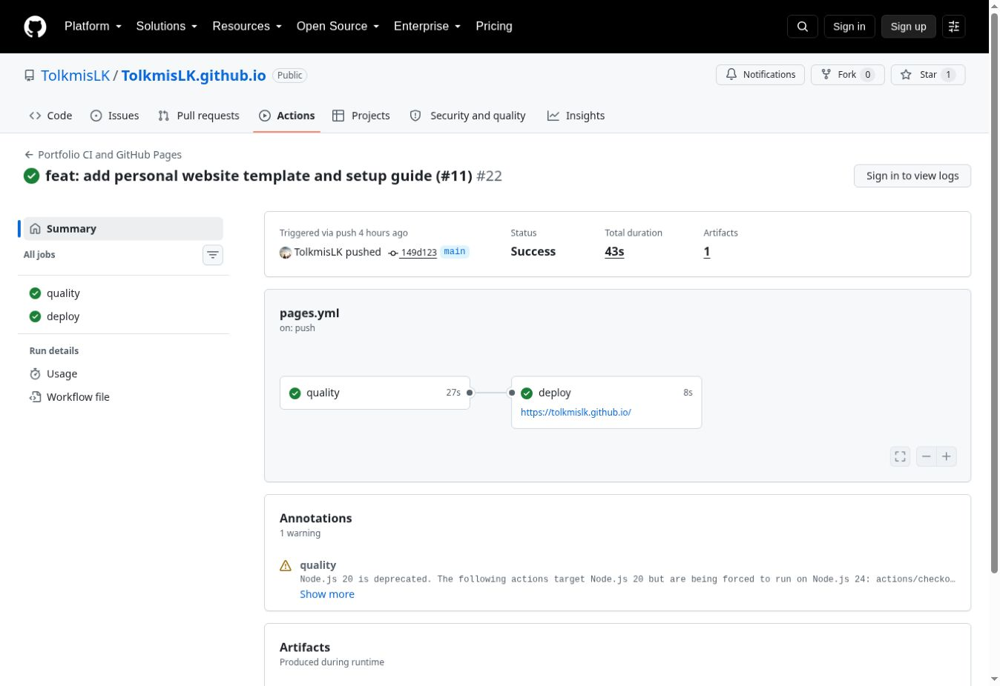
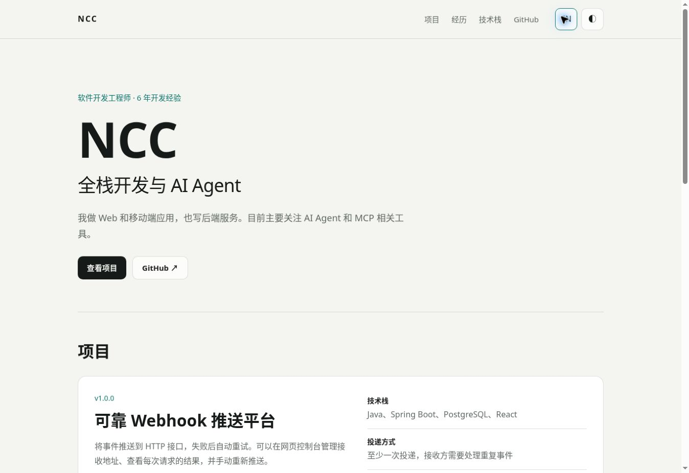

# 跟着做一个自己的网页

[完整教程](../README.md) · [空白配置](../examples/site.example.json) · [搭建求助](https://github.com/TolkmisLK/TolkmisLK.github.io/issues/new/choose)

下面是模板仓库、配置文件和成功发布记录的实际截图。截图中的账号是 `TolkmisLK`；复制完成后，请在自己的仓库继续操作。GitHub 界面可能随版本略有变化。

## 1. 找到复制入口

登录 GitHub，打开模板仓库，点击右上角 **Fork**。截图是未登录时的页面；登录后才能创建自己的副本。

复制时，Owner 选自己，名称填写 `你的GitHub用户名.github.io`。例如用户名为 `xiaoming`，仓库名就是 `xiaoming.github.io`。已有同名仓库时，请先阅读完整教程的常见问题。

如果仓库右上角出现 **Use this template**，也可以通过 **Create a new repository** 创建。

## 2. 开启发布

在**自己刚创建的仓库**中：

1. 点 **Actions**，如果 GitHub 提示工作流尚未启用，先启用。
2. 点 **Settings → Pages**。
3. 找到 **Build and deployment → Source**，选择 **GitHub Actions**。

这里已经有发布流程，不需要再添加工作流。找不到 Settings 时，先确认当前仓库的 Owner 是自己。

设置页只有仓库管理员才能看到。[GitHub 官方的 Pages 设置图文说明](https://docs.github.com/en/pages/getting-started-with-github-pages/configuring-a-publishing-source-for-your-github-pages-site#publishing-with-a-custom-github-actions-workflow)中也列出了这个选项。

## 3. 换成自己的资料

先打开 `examples/site.example.json`。代码右上方的两个重叠方框是复制按钮，也可以点 **Raw** 后全选复制。

然后打开自己仓库里的 `content/site.json`，点铅笔按钮，将内容全部替换成复制的空白配置。需要改的是 `content/site.json`；仅修改 `examples/site.example.json` 不会改变网页。

可以先填这些内容：

| 配置位置 | 示例 | 网页里会出现在哪里 |
| --- | --- | --- |
| `identity.name` | `小明` | 左上角名称和首屏大标题 |
| `identity.githubUsername` | `xiaoming` | GitHub 链接 |
| `identity.repositoryName` | `xiaoming.github.io` | 页面底部的源码链接 |
| `identity.siteUrl` | `https://xiaoming.github.io` | 网页地址与资源路径 |
| `identity.defaultLocale` | `zh` | 第一次打开默认显示中文 |
| `zh.role` | `学生，正在学习前端` | 名字上方的一行文字 |
| `zh.subtitle` | `我的学习与小项目` | 名字下方的标题 |
| `zh.intro` | `你好，我是小明。这里记录我做过的网页和正在学习的内容。` | 首屏介绍 |
| `zh.experienceCopy` | `最近在学习 HTML、CSS 和 JavaScript，尝试做一些能在浏览器里使用的小工具。` | 经历部分 |

英文放在对应的 `en` 字段里。暂时没有项目，让两种语言的 `projects` 都保持 `[]` 即可。不要删除双引号、逗号和括号。

修改后点 **Commit changes**，再确认提交到 **main**。

## 4. 判断是否发布成功

打开 **Actions**，点最新的 **Portfolio CI and GitHub Pages** 运行记录。

- **quality**：检查配置并生成网页。
- **deploy**：把生成的网页发布出去。
- 两项都带绿色对勾后，点 **deploy 下方的网站链接**。

这是一次已经完成的发布记录。时间和提交标题会与你的不同；截图底部的黄色提示是旧版工作流依赖的提醒，和绿色的发布结果是两回事。

如果某一步出现红叉，点开失败步骤，查看最先出现的错误。可以把运行记录的地址贴到“搭建求助”，不用先看懂整页日志。

## 5. 看看最终效果

这是线上示例的中文首屏。替换配置后，名字、介绍和项目就会换成你填写的内容。

打开自己的网站后，检查名字、介绍、GitHub 链接，以及右上方的语言和主题按钮。以后更新 `content/site.json` 并提交到 `main`，网页就会再次发布。

完成了，或者在哪一步卡住了，都可以通过 [Issues](https://github.com/TolkmisLK/TolkmisLK.github.io/issues/new/choose) 留下反馈。

## English

These are real screenshots of the repository, starter configuration, successful deployment, and live Chinese example. Follow the [English guide](README.en.md) for the full instructions.

1. Sign in and use **Fork** (or **Use this template**, if available) to create your own repository.
2. Enable Actions and select **Settings → Pages → Source → GitHub Actions** in your copy.
3. Copy `examples/site.example.json` into `content/site.json`, edit your identity and both language sections, then commit to `main`.
4. Wait for both **quality** and **deploy** to succeed. Open the site link below **deploy**.
5. Check your name, introduction, links, language button, and theme button. Share any confusing steps through [Issues](https://github.com/TolkmisLK/TolkmisLK.github.io/issues/new/choose).
